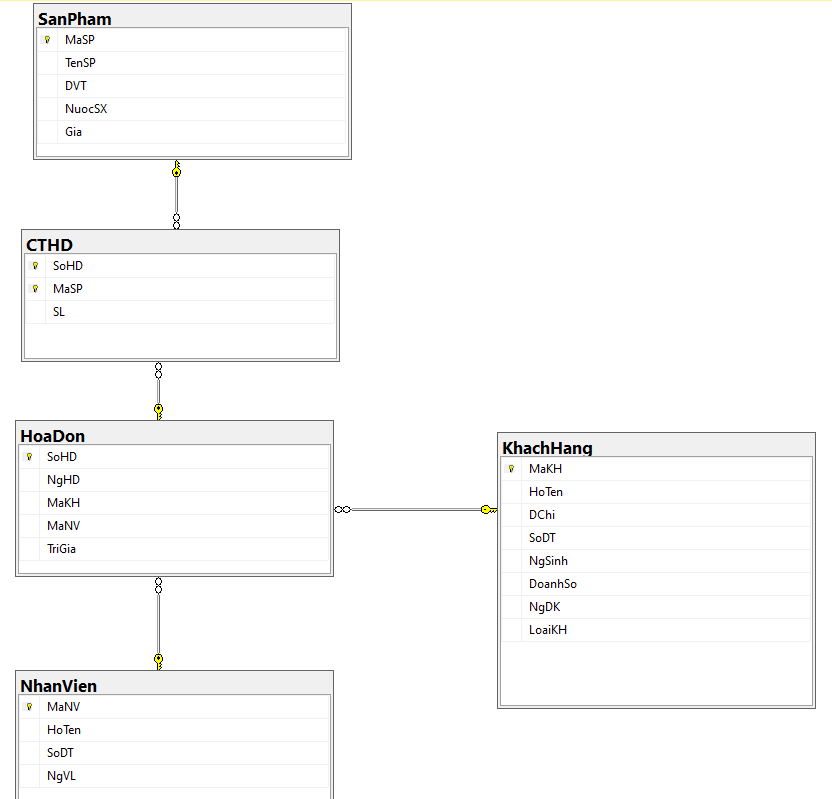

# Sales Manager - SQL
Link to the [Problem](Input/Sales_Manager_Theme.pdf)

## Task List
-  Tạo cơ sở dữ liệu quản lí bán hàng
-  Định nghĩa dữ liệu
-  Truy vấn dữ liệu
## Database

    

## Learn things from the project
- Biết cách tạo cơ sở dư liệu, tạo bảng, khóa chính, khóa ngoại, thêm dữ liệu cho bảng, thêm ràng buộc cho dữ liệu, cập nhập dữ liệu,..
- Chỉnh sửa bảng, xóa bảng,..
- Truy vấn dữ liệu đơn giản: select, from, where, join, group by, order by, having, truy vấn con,...